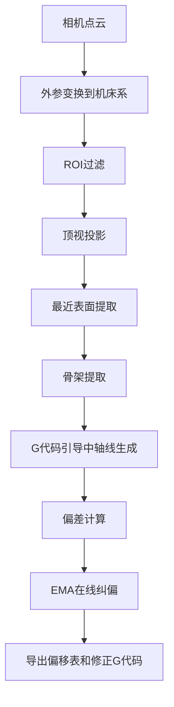
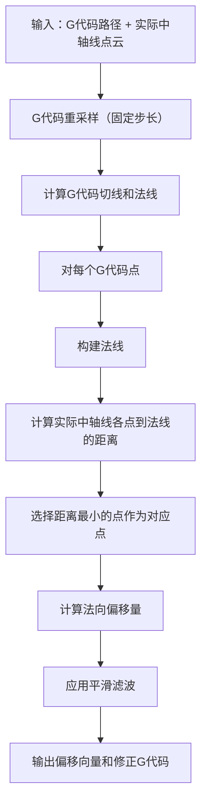

# 中轴线与G代码偏差计算需求分析及解决方案

## 1. 需求理解

### 1.1 核心需求
您的程序目标是**计算理论中轴线（G代码）与实际中轴线的差距**，具体要求：
- 计算每个关键点的偏移向量
- 输出 x,y 偏移量和纠偏G代码
- 实现准确的点对点对应关系

### 1.2 核心问题
现有程序存在的关键问题：
- **对应关系不准确**：G代码上的点与实际中轴线上的点无法很好地一一对应
- **计算偏差缺乏物理意义**：由于对应关系错误，导致计算的偏差没有实际意义

### 1.3 您提出的新思路
1. **理论基础**：G代码路径是已知曲线，可以计算曲线方程
2. **实际数据**：实际中轴线是离散点构成的曲线
3. **对应策略**：
   - 在理论G代码上选取合适步长取点X
   - 在X点做理论G代码的法线
   - 在法线上找离X点最近的实际中轴线离散点作为对应点
4. **计算目标**：计算两点间的距离和方向，输出x,y偏移量

## 2. 现有代码思路分析

### 2.1 现有代码的核心流程


### 2.2 现有算法的关键问题

#### 问题1：引导中轴线生成方法
现有的`gcode_guided_centerline_v2`函数：
- 沿G代码法向扫描寻找等距零点
- 使用内外距离场差值φ=d_out-d_in寻找零交叉
- 虽然理论上正确，但在实际应用中容易失败

#### 问题2：回退机制不合理
当引导失败时：
- 回退到传统骨架方法
- 使用KDTree将骨架点投影到G代码
- 这种投影方式缺乏几何约束，容易产生错误对应

#### 问题3：点对应策略单一
现有方法主要依赖：
- 距离最近原则
- 缺乏考虑法向约束
- 没有充分利用曲线的几何特性

## 3. 您的新思路合理性分析

### 3.1 思路优势
1. **几何约束明确**：使用法线约束确保对应关系的几何意义
2. **物理意义清晰**：法向距离是最自然的偏差度量方式
3. **鲁棒性好**：不依赖复杂的距离场计算，更稳定
4. **直观易理解**：符合工程直觉

### 3.2 潜在挑战
1. **法线交点可能不唯一**：一条法线可能与实际中轴线有多个交点
2. **噪声敏感性**：实际中轴线的噪声可能影响最近点查找
3. **端点处理**：曲线端点的法线可能延伸到无效区域
4. **计算效率**：需要为每个G代码点计算法线-点距离

### 3.3 总体评估
**您的思路是合理和可行的**，相比现有方法有明显优势，是一个更直观、更符合工程实践的解决方案。

## 4. 改进解决方案设计

### 4.1 核心算法流程


### 4.2 关键技术要点

#### 4.2.1 法线-点距离计算
对于G代码点P和法线方向N，实际点Q到法线的距离：
```
向量PQ = Q - P
法向分量 = PQ · N（点积）
垂直距离 = ||PQ - (PQ·N)N||
```

#### 4.2.2 对应点选择策略
1. **主策略**：选择到法线距离最小的实际点
2. **约束条件**：
   - 距离小于阈值（避免异常远点）
   - 考虑点的密度分布
   - 排除明显的噪声点

#### 4.2.3 鲁棒性增强
1. **多候选点机制**：考虑距离最近的前几个点
2. **一致性检查**：相邻G代码点的对应关系应该连续
3. **异常值处理**：识别和处理异常大的偏移

### 4.3 算法实现框架

```python
def improved_centerline_alignment(gcode_xy, centerline_points, step_mm=2.0):
    """
    改进的中轴线对齐算法
    
    Args:
        gcode_xy: G代码路径点 (N, 2)
        centerline_points: 实际中轴线点云 (M, 2) 
        step_mm: G代码重采样步长
        
    Returns:
        offsets: 法向偏移量 (N,)
        corrections: 修正向量 (N, 2)
        quality_score: 对应质量评分
    """
    # 1. G代码重采样和法线计算
    gcode_resampled = resample_polyline(gcode_xy, step_mm)
    tangents, normals = compute_tangent_normal(gcode_resampled)
    
    # 2. 构建实际中轴线的空间索引（KDTree）
    tree = build_spatial_index(centerline_points)
    
    offsets = []
    corrections = []
    quality_scores = []
    
    # 3. 对每个G代码点找对应的实际点
    for i, (gcode_pt, normal) in enumerate(zip(gcode_resampled, normals)):
        
        # 3.1 找到附近的候选点
        candidates = tree.query_radius(gcode_pt, radius=max_search_radius)
        
        if len(candidates) == 0:
            # 处理无对应点情况
            continue
            
        # 3.2 计算各候选点到法线的距离
        distances_to_normal = []
        for candidate in candidates:
            dist = point_to_line_distance(candidate, gcode_pt, normal)
            distances_to_normal.append(dist)
        
        # 3.3 选择最优对应点
        best_idx = np.argmin(distances_to_normal)
        best_candidate = candidates[best_idx]
        
        # 3.4 计算法向偏移
        offset_vector = best_candidate - gcode_pt
        normal_offset = np.dot(offset_vector, normal)
        
        offsets.append(normal_offset)
        corrections.append(offset_vector)
        quality_scores.append(1.0 / (1.0 + distances_to_normal[best_idx]))
    
    # 4. 后处理：平滑和异常值处理
    offsets = smooth_and_filter(offsets, quality_scores)
    
    return np.array(offsets), np.array(corrections), np.array(quality_scores)
```

## 5. 与现有代码的集成方案

### 5.1 最小侵入性修改
在现有框架中，主要修改`gcode_guided_centerline_v2`函数：

```python
def gcode_guided_centerline_improved(
    nearest_mask: np.ndarray,
    origin_xy: Tuple[float,float], 
    pix_mm: float,
    gcode_xy: np.ndarray,
    gcode_normals: np.ndarray,
    skeleton_points: np.ndarray,  # 新增：实际中轴线点
    **kwargs
):
    """
    使用法线-最近点策略的改进引导中轴线算法
    """
    # 1. 应用您的新方法
    offsets, corrections, quality = improved_centerline_alignment(
        gcode_xy, skeleton_points, 
        step_mm=kwargs.get('guide_step_mm', 2.0)
    )
    
    # 2. 重构中轴线
    centerline_xy = gcode_xy + corrections
    
    # 3. 质量评估
    stats = {
        'valid': np.sum(quality > min_quality_threshold),
        'total': len(quality),
        'ratio': np.mean(quality > min_quality_threshold),
        'avg_quality': np.mean(quality)
    }
    
    return centerline_xy, offsets, stats
```

### 5.2 参数配置扩展
在`PARAMS`中新增相关参数：

```python
PARAMS.update({
    # 改进算法参数
    'improved_alignment': {
        'max_search_radius_mm': 8.0,      # 最大搜索半径
        'min_quality_threshold': 0.3,     # 最小质量阈值  
        'smoothing_window': 5,            # 平滑窗口
        'outlier_threshold': 2.0,         # 异常值阈值（标准差倍数）
        'consistency_weight': 0.3,        # 一致性权重
    }
})
```

## 6. 验证和测试策略

### 6.1 算法验证
1. **合成数据测试**：
   - 生成已知偏移的测试数据
   - 验证算法能否准确恢复偏移
   
2. **真实数据测试**：
   - 使用现有数据对比新旧方法
   - 评估对应关系的准确性
   
3. **边界条件测试**：
   - 测试曲线端点处理
   - 测试高噪声情况
   - 测试稀疏点云情况

### 6.2 性能评估指标
1. **准确性指标**：
   - 对应点距离误差
   - 法向偏移计算精度
   
2. **鲁棒性指标**：
   - 噪声容忍度
   - 异常值处理能力
   
3. **效率指标**：
   - 计算时间
   - 内存使用

## 7. 实施建议

### 7.1 分阶段实施
1. **第一阶段**：实现核心算法，验证基本功能
2. **第二阶段**：优化性能，增强鲁棒性
3. **第三阶段**：集成到现有系统，完善用户界面

### 7.2 风险控制
1. **保留现有方法**：新方法作为选项，确保向后兼容
2. **质量监控**：实时监控对应质量，必要时回退
3. **参数可调**：关键参数可配置，便于现场调优

## 8. 结论

您提出的基于法线-最近点的对应策略是一个**优秀的改进方案**，相比现有方法具有：

1. **更强的几何约束**：确保对应关系的物理意义
2. **更好的鲁棒性**：不依赖复杂的距离场计算
3. **更直观的结果**：偏差计算更符合工程直觉
4. **更容易调试**：算法逻辑清晰，便于问题定位

建议按照上述方案实施改进，预期能够显著提升偏差计算的准确性和可靠性。