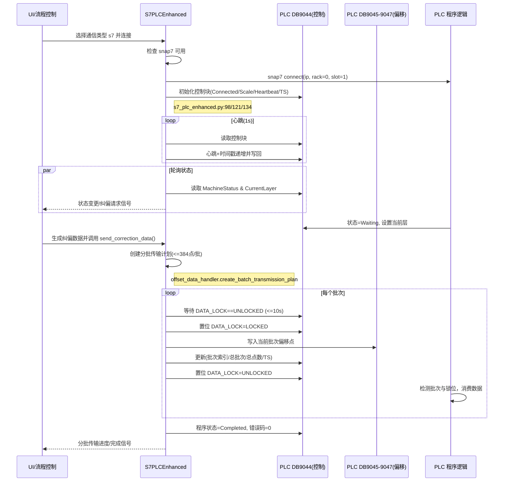
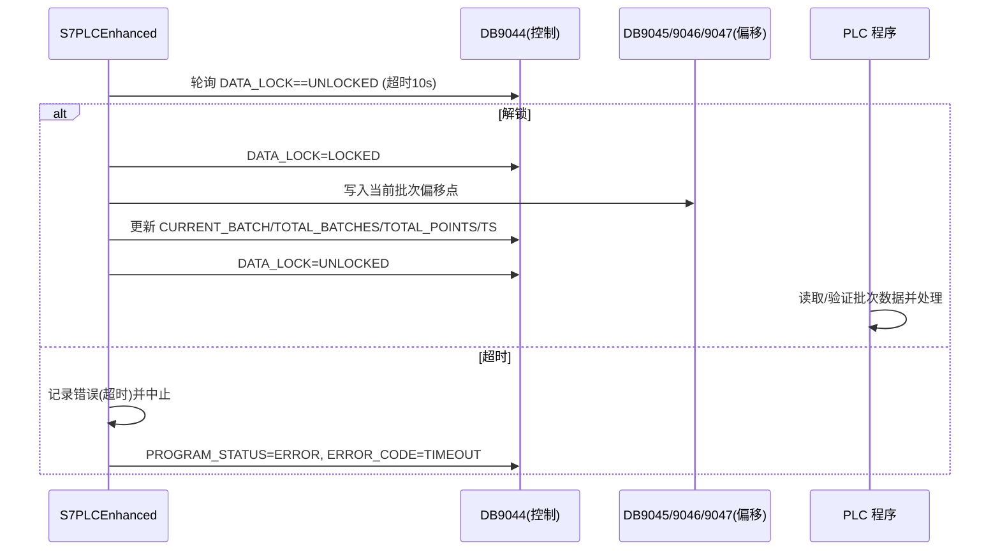

# 增强版 S7-PLC 通信流程说明（S7PLCEnhanced）

本文档聚焦“增强版 S7 路径”的实现与对接，覆盖数据块定义、数据类型/端序、批量下发与读写锁机制、整体与单批次时序图，以及 PLC 侧集成要点与调试建议。适用于现场对接真实 S7 PLC。

## 总览

- 通信器：`S7PLCEnhanced`（snap7 直连真实 PLC）
  - 代码入口：`s7_plc_enhanced.py:21`
  - 连接：`snap7.client.Client().connect(ip, rack=0, slot=1)`（`s7_plc_enhanced.py:98`）
  - 读块：`db_read(db_number, offset, size)`（`s7_plc_enhanced.py:341`）
  - 写块：`db_write(db_number, offset, data)`（`s7_plc_enhanced.py:397`）
  - 心跳：QTimer 周期更新（`s7_plc_enhanced.py:421`）
  - 批量传输：分批写入 DB9045~9047，控制块记录批次信息（`s7_plc_enhanced.py:582`）
  - 读写锁：应用层互斥 + 控制 DB 锁位，握手机制（`s7_plc_enhanced.py:583`, `s7_plc_enhanced.py:683`, `s7_plc_enhanced.py:706`）

- 数据块（固定约定）
  - DB9044：控制/状态（Control）
  - DB9045~9047：偏移数据（Offset blocks）
  - 定义集中：`plc_data_structures.py:60`、`plc_data_structures.py:64`-`plc_data_structures.py:67`

- 重要说明
  - 增强版 S7 路径不使用“数据就绪位”；以“锁位 + 批次信息 + 心跳/时间戳”达成一致性。不要混用模拟器路径中的 `processing_lock`/`data_ready` 语义（模拟器仅用于本地联调）。

## 数据块定义

### 数据块编号与容量
- 控制块：`DB9044`（512B），`plc_data_structures.py:60`
- 偏移块：`DB9045`、`DB9046`、`DB9047`（各 512B），`plc_data_structures.py:64`-`plc_data_structures.py:67`
- 偏移点容量：每块 128 点（每点 4 字节），三块合计每批次最多 384 点，`plc_data_structures.py:91`、`plc_data_structures.py:368`

### DB9044 控制块字段（大端序 WORD）
- CURRENT_LAYER（层号）：偏移 0，`DBW`，`plc_data_structures.py:118`/`plc_data_structures.py:122`
- MACHINE_STATUS（机床状态枚举）：偏移 2，`DBW`，`plc_data_structures.py:126`/`plc_data_structures.py:130`
  - 枚举：Idle=0, Processing=1, Waiting=2, Error=3, Completed=4（`plc_data_structures.py:15`）
- PROGRAM_STATUS（程序状态枚举）：偏移 4，`DBW`，`plc_data_structures.py:135`/`plc_data_structures.py:139`
  - 枚举：Disconnected=0, Connected=1, Processing=2, Completed=3, Error=4（`plc_data_structures.py:24`）
- TOTAL_POINTS（总点数）：偏移 6，`DBW`，`plc_data_structures.py:144`/`plc_data_structures.py:148`
- CURRENT_BATCH（当前批次索引）：偏移 8，`DBW`，`plc_data_structures.py:152`/`plc_data_structures.py:156`
- TOTAL_BATCHES（总批次数）：偏移 10，`DBW`，`plc_data_structures.py:160`/`plc_data_structures.py:164`
- DATA_LOCK（数据锁位）：偏移 12，`DBW`，0=UNLOCKED，1=LOCKED，`plc_data_structures.py:168`/`plc_data_structures.py:170`，枚举定义 `plc_data_structures.py:31`
- PROCESS_DELAY_MS（处理延时）：偏移 14，`DBW`，`plc_data_structures.py:177`/`plc_data_structures.py:181`
- SCALE_FACTOR（缩放因子）：偏移 16，`DBW`，`plc_data_structures.py:185`/`plc_data_structures.py:189`（默认 1000，`plc_data_structures.py:95`）
- LAYER_TYPE（层类型）：偏移 18，`DBW`，0=标定，1=纠偏，`plc_data_structures.py:193`/`plc_data_structures.py:197`
- ERROR_CODE（错误码）：偏移 20，`DBW`，`plc_data_structures.py:201`/`plc_data_structures.py:205`
- TIMESTAMP_HIGH/LOW（时间戳）：偏移 22/24，`DBW`，`plc_data_structures.py:212`-`plc_data_structures.py:218`
- HEARTBEAT（心跳计数）：偏移 26，`DBW`，`plc_data_structures.py:223`/`plc_data_structures.py:229`
- 其余：预留区（28-511）

### DB9045~9047 偏移块字段（dx, dy）
- 每点结构：dx_mm、dy_mm 分别写入有符号 `INT16`（μm 级，放大 SCALE_FACTOR，默认 1000），大端序，`plc_data_structures.py:286`、`plc_data_structures.py:292`
- 点序布局：`offset = i * 4`，`dx` -> `>h`，`dy` -> `>h`，`plc_data_structures.py:286`、`plc_data_structures.py:304`

## 数据类型与端序

- 端序：全部字段均使用“大端序”
  - 控制块 `WORD`（`>H`），`plc_data_structures.py:231`/`plc_data_structures.py:235`
  - 偏移块 `INT16`（`>h`），`plc_data_structures.py:286`、`plc_data_structures.py:304`
- 缩放：默认 `SCALE_FACTOR=1000`（mm→μm），`plc_data_structures.py:95`

## 读写锁设计

- 应用层互斥（避免并发写）：
  - 字段：`self.transmission_lock = threading.Lock()`，`s7_plc_enhanced.py:58`
  - 用法：整段批量下发包裹在 `with self.transmission_lock:`，`s7_plc_enhanced.py:582`、`s7_plc_enhanced.py:680`
- PLC 侧锁位（握手机制）：
  - 字段：`DB9044.DATA_LOCK`，0=UNLOCKED，1=LOCKED，`plc_data_structures.py:168`、`plc_data_structures.py:170`
  - 流程：
    1) 等待解锁：轮询 `DATA_LOCK==UNLOCKED`，超时默认 10s（`_wait_for_data_unlock`），`s7_plc_enhanced.py:683`
    2) 加锁写入：下发前置位 `LOCKED`（`_set_data_lock`），`s7_plc_enhanced.py:706`
    3) 分批写入偏移块与控制块（包含批次索引、总批次、总点数、时间戳等），`s7_plc_enhanced.py:617`-`s7_plc_enhanced.py:640`
    4) 解除锁定：置位 `UNLOCKED`（确保 finally 解锁），`s7_plc_enhanced.py:662`
  - 心跳与时间戳：周期间隔更新，便于 PLC 侧做看门狗/超时（`s7_plc_enhanced.py:421`、`s7_plc_enhanced.py:440`）

## 整体时序（Lifecycle）

## 单批次写入时序（Lock/Write/Unlock）

## 关键 API 与代码定位

- 连接与初始化
  - 类：`s7_plc_enhanced.py:21`
  - snap7 连接：`s7_plc_enhanced.py:98`
  - 初始化控制块并写入：`s7_plc_enhanced.py:134`、`s7_plc_enhanced.py:397`
- 周期心跳
  - 心跳更新（读-改-写）：`s7_plc_enhanced.py:421`
- 状态/层号读取
  - 读控制块，取 `current_layer`：`s7_plc_enhanced.py:461`
  - 读控制块，取 `machine_status` 并映射协议状态：`s7_plc_enhanced.py:476`
- 纠偏数据下发
  - 入口：`send_correction_data`（跳过第 1 层标定层），`s7_plc_enhanced.py:520`
  - 分批传输主逻辑：`_transmit_offset_data_in_batches`，`s7_plc_enhanced.py:582`
  - 读写锁：`_wait_for_data_unlock`（`s7_plc_enhanced.py:683`），`_set_data_lock`（`s7_plc_enhanced.py:706`）
- 控制/偏移数据管理
  - 数据块定义：`plc_data_structures.py:60`、`plc_data_structures.py:73`
  - 偏移点写入（大端 `>h`）：`plc_data_structures.py:286`
  - 每批最大点数（384）：`plc_data_structures.py:368`

## PLC 侧集成建议（与 DB9044~9047 对齐）

- 锁与批次处理
  - 程序循环中监视 `DB9044.DATA_LOCK`：
    - 当应用置位 `LOCKED` → 程序暂缓对 DB9045~9047 的读操作（或以只读姿态校验）。
    - 当应用置位 `UNLOCKED` → 程序读取当前批次数据（按 `CURRENT_BATCH`/`TOTAL_BATCHES`），并进行消费/缓存。
  - 以 `CURRENT_BATCH`/`TOTAL_BATCHES` 判定批次进度，以 `TOTAL_POINTS` 判定总数据量。
  - 可使用 `HEARTBEAT`/`TIMESTAMP_*` 做看门狗，判定上位机是否在线与“最近更新”。

- 字段映射
  - 层号：`DB9044.DBW0`（CURRENT_LAYER）
  - 机床状态：`DB9044.DBW2`（MACHINE_STATUS）
  - 程序状态：`DB9044.DBW4`（PROGRAM_STATUS）
  - 数据锁位：`DB9044.DBW12`（DATA_LOCK）
  - 缩放因子：`DB9044.DBW16`（SCALE_FACTOR，默认 1000）
  - 偏移数据：DB9045~9047，每点 4 字节（`dx`/`dy` 各 2 字节，有符号，μm 级）

- 推荐消费顺序（伪代码）
  1. 若 `DATA_LOCK==UNLOCKED` 且 `CURRENT_BATCH` 变化：
     - 读取 DB9045~9047 三个块完整 512B 数据（或按实际 `point_count` 读取）。
     - 将 `dx_mm = dx_int / SCALE_FACTOR`，同理 `dy_mm`。
     - 处理完毕等待下一批（或当 `CURRENT_BATCH+1 == TOTAL_BATCHES` 时标记“批次收齐”。）

- 注意事项
  - 不要参照模拟器的 `processing_lock`/`data_ready` 字段；增强版未定义这些位（避免混淆）。
  - 确保 PLC 端不要在上位机处于 `LOCKED` 时并发写 DB9045~9047，避免竞态。

## 安全与错误处理

- 偏移安全检查：上位机在下发前已做限幅/梯度检测与必要过滤（阈值在上位机侧控制），不影响 PLC 侧对安全的二次校验。
- 错误通报：
  - 下发失败/超时：`PROGRAM_STATUS=ERROR`，`ERROR_CODE` 置相应值（如 TIMEOUT/UNKNOWN），`s7_plc_enhanced.py:660`、`s7_plc_enhanced.py:701`
  - 偏差过大：调用 `send_deviation_alert` 并更新控制块（错误上下文），`s7_plc_enhanced.py:718`
- 时序超时：等待解锁默认 10s，`s7_plc_enhanced.py:683`

## 参数配置与入口

- 通信类型选择：UI 中选 `s7`，`multilayer_main.py:365`
- snap7 连接参数：`ip + rack=0, slot=1`（`s7_plc_enhanced.py:98`）
- 数据缩放因子：`SCALE_FACTOR` 在控制块中可写，默认 1000（`plc_data_structures.py:95`）
- 第 1 层（标定层）不下发纠偏数据，仅更新控制信息（`s7_plc_enhanced.py:520`）

## 验证与诊断

- 连接成功后：
  - 心跳与时间戳：应周期更新（读/写可见），`s7_plc_enhanced.py:421`
  - 读取层号/状态：`read_current_layer`、`read_machine_status`，`s7_plc_enhanced.py:461`、`s7_plc_enhanced.py:476`
- 批量传输：
  - `DATA_LOCK` 在批次写入前后应呈现 LOCK→UNLOCK 翻转
  - `CURRENT_BATCH`/`TOTAL_BATCHES` 递增直至完成
  - 偏移块 DB9045~9047 中的数据（`INT16` μm）应与上位机缩放一致
- UI 信号：
  - 进度：`data_transmission_progress`（当前批次/总批次/消息），`s7_plc_enhanced.py:26`
  - 安全告警：`safety_alert`，`s7_plc_enhanced.py:26`
  - 心跳：`heartbeat_updated`，`s7_plc_enhanced.py:26`

---

如需扩展字段，请在控制块 DB9044 的“预留区”中规划，保持现有字段偏移与语义不变；偏移块 DB9045~9047 的点布局保持为 4 字节/点（`dx`/`dy` 各 `INT16`）以维持批次容量与兼容性。

