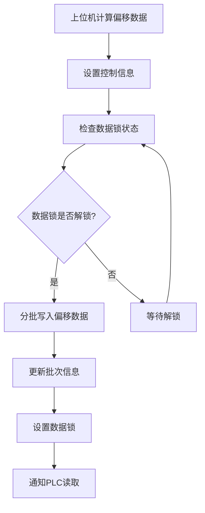
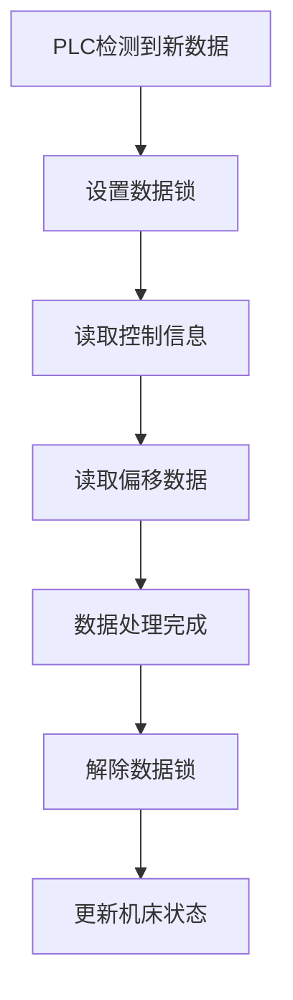

# PLC地址映射配置说明文档

## 概述

本文档详细说明了多层加工纠偏系统中PLC数据块的地址配置和用途。系统采用西门子S7协议，使用4个数据块进行数据交换。

## 数据块概述

| 数据块编号 | 名称 | 大小 | 用途 |
|-----------|------|------|------|
| DB9044 | 控制和状态信息块 | 512字节 | 存储系统控制参数、状态信息和元数据 |
| DB9045 | 偏移数据块1 | 512字节 | 存储第一批偏移数据（128个偏移点） |
| DB9046 | 偏移数据块2 | 512字节 | 存储第二批偏移数据（128个偏移点） |
| DB9047 | 偏移数据块3 | 512字节 | 存储第三批偏移数据（128个偏移点） |

## DB9044 控制数据块地址映射

### 控制信息区域

| 地址 | 数据类型 | 变量名 | 说明 | 取值范围 |
|------|----------|--------|------|----------|
| DB9044.DBW0 | INT | 当前层号 | 正在加工或待加工的层号 | 0-65535 |
| DB9044.DBW2 | INT | 机床状态 | 机床当前工作状态 | 见机床状态枚举 |
| DB9044.DBW4 | INT | 程序状态 | 上位机程序运行状态 | 见程序状态枚举 |
| DB9044.DBW6 | INT | 总偏移点数量 | 当前层的偏移点总数 | 0-65535 |
| DB9044.DBW8 | INT | 当前批次索引 | 当前正在传输的数据批次编号 | 0-65535 |
| DB9044.DBW10 | INT | 总批次数量 | 本层数据需要的总批次数 | 0-65535 |

### 系统控制区域

| 地址 | 数据类型 | 变量名 | 说明 | 取值范围 |
|------|----------|--------|------|----------|
| DB9044.DBW12 | INT | 数据锁状态 | 数据读写锁定标志 | 0=解锁, 1=锁定 |
| DB9044.DBW14 | INT | 处理延迟时间 | PLC处理延迟时间(毫秒) | 0-65535 |
| DB9044.DBW16 | INT | 数据缩放因子 | 浮点数转整数的放大倍数 | 推荐值: 1000 |
| DB9044.DBW18 | INT | 层类型 | 当前层的加工类型 | 0=标定层, 1=纠偏层 |
| DB9044.DBW20 | INT | 错误代码 | 系统错误状态码 | 见错误代码定义 |

### 系统监控区域

| 地址 | 数据类型 | 变量名 | 说明 | 取值范围 |
|------|----------|--------|------|----------|
| DB9044.DBW22 | INT | 时间戳高位 | 数据更新时间戳的高16位 | 0-65535 |
| DB9044.DBW24 | INT | 时间戳低位 | 数据更新时间戳的低16位 | 0-65535 |
| DB9044.DBW26 | INT | 心跳计数器 | 通信心跳监控计数器 | 0-65535(循环) |
| DB9044.DBW28-510 | - | 预留空间 | 系统预留，用于未来扩展 | - |

## 状态枚举定义

### 机床状态 (DB9044.DBW2)

| 数值 | 状态名称 | 说明 |
|------|----------|------|
| 0 | IDLE | 空闲状态，等待任务 |
| 1 | PROCESSING | 正在加工中 |
| 2 | WAITING | 等待纠偏数据 |
| 3 | ERROR | 机床错误状态 |
| 4 | COMPLETED | 全部任务完成 |

### 程序状态 (DB9044.DBW4)

| 数值 | 状态名称 | 说明 |
|------|----------|------|
| 0 | DISCONNECTED | 上位机未连接 |
| 1 | CONNECTED | 已连接，准备就绪 |
| 2 | PROCESSING | 正在处理数据 |
| 3 | COMPLETED | 处理完成 |
| 4 | ERROR | 程序错误状态 |

### 数据锁状态 (DB9044.DBW12)

| 数值 | 状态名称 | 说明 |
|------|----------|------|
| 0 | UNLOCKED | 数据可读写 |
| 1 | LOCKED | 数据被锁定，禁止写入 |

### 错误代码 (DB9044.DBW20)

| 数值 | 错误名称 | 说明 |
|------|----------|------|
| 0 | NO_ERROR | 无错误 |
| 1 | CONNECTION_ERROR | 通信连接错误 |
| 2 | DATA_VALIDATION_ERROR | 数据验证错误 |
| 3 | OFFSET_TOO_LARGE | 偏移量超出范围 |
| 4 | BATCH_INDEX_ERROR | 批次索引错误 |
| 5 | TIMEOUT_ERROR | 超时错误 |
| 99 | UNKNOWN_ERROR | 未知错误 |

## 偏移数据块结构 (DB9045-DB9047)

### 数据组织方式

- **每个数据块容量**: 512字节
- **每个偏移点大小**: 4字节 (dx + dy 各2字节)
- **每个数据块存储点数**: 128个偏移点
- **总存储容量**: 384个偏移点 (3个数据块)

### 偏移点数据格式

每个偏移点占用4字节，按以下格式存储：

| 偏移量 | 数据类型 | 说明 | 数值范围 |
|--------|----------|------|----------|
| +0 | INT | X方向偏移量(放大后) | -32767 ~ +32767 |
| +2 | INT | Y方向偏移量(放大后) | -32767 ~ +32767 |

### 数据块地址计算

对于第n个偏移点(从0开始)：
- **数据块选择**: `DB_NUMBER = 9045 + (n ÷ 128)`
- **块内偏移**: `OFFSET = (n % 128) × 4`
- **X偏移地址**: `DB[DB_NUMBER].DBW[OFFSET]`
- **Y偏移地址**: `DB[DB_NUMBER].DBW[OFFSET+2]`

### 数据缩放规则

由于PLC只支持整数传输，浮点数需要按以下规则处理：
- **发送数据**: `PLC_VALUE = FLOAT_VALUE × 1000`
- **接收数据**: `FLOAT_VALUE = PLC_VALUE ÷ 1000`
- **精度**: 0.001mm
- **范围**: ±32.767mm

## 数据通信流程

### 1. 数据写入流程

### 2. 数据读取流程

## 配置建议

### 推荐配置参数

| 参数 | 推荐值 | 说明 |
|------|--------|------|
| 层号地址 | DB9044.DBW0 | 标准配置 |
| 缩放因子 | 1000 | 保证0.001mm精度 |
| 处理延迟 | 2000ms | 根据PLC性能调整 |
| 心跳间隔 | 1000ms | 通信监控间隔 |

### 地址配置格式

在系统配置中，地址格式为：`DB[数据块号].DB[数据类型][偏移地址]`

**示例**：
- 当前层号：`DB9044.DBW0`
- 机床状态：`DB9044.DBW2`
- 第1个偏移点X：`DB9045.DBW0`
- 第1个偏移点Y：`DB9045.DBW2`

## 注意事项

1. **数据字节序**: 所有数据采用大端序(Big-Endian)格式
2. **数据锁机制**: 写入数据前必须检查数据锁状态
3. **批次处理**: 大量偏移点需要分批传输，注意批次索引管理
4. **错误处理**: 定期检查错误代码，及时处理异常情况
5. **心跳监控**: 利用心跳计数器监控通信状态
6. **时间戳**: 用于数据同步和版本控制

## 故障排查

### 常见问题及解决方案

1. **数据不更新**: 检查数据锁状态和心跳计数器
2. **偏移量异常**: 验证缩放因子和数值范围
3. **通信超时**: 检查网络连接和PLC响应时间
4. **批次错误**: 确认批次索引和总批次数计算正确

---

*本文档基于 plc_data_structures.py 生成，版本日期：2025-10-09*