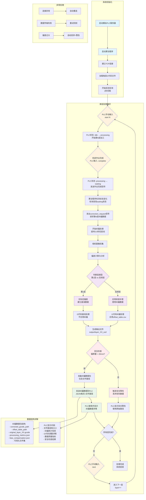
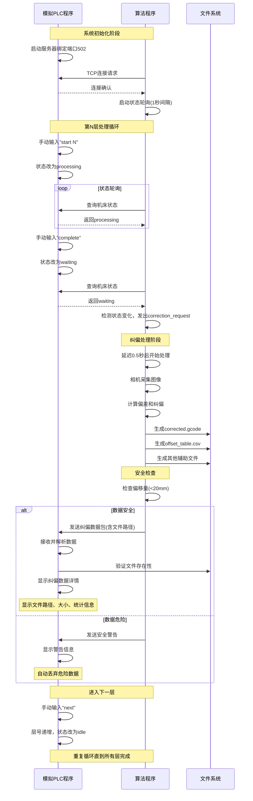
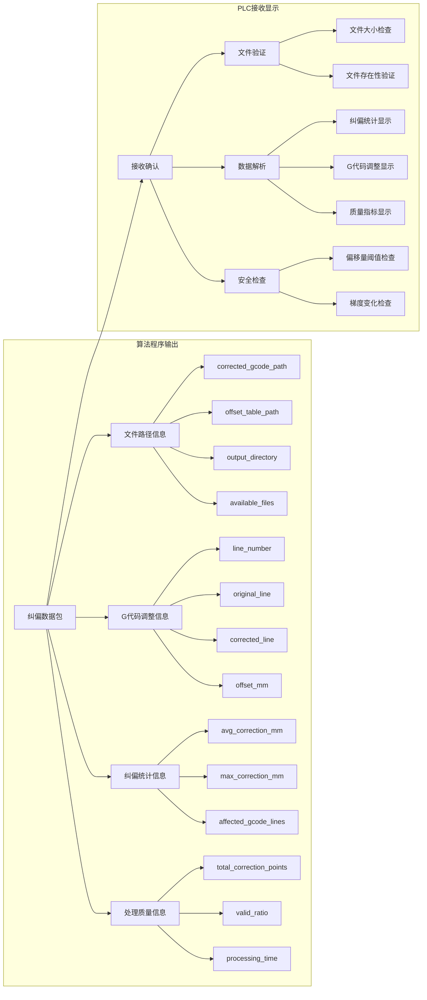

## 模拟PLC与算法程序数据交互流程图

### 📋 整体数据交换逻辑概述

整个多层加工纠偏系统的数据交换逻辑遵循以下核心流程：

#### 🔗 系统连接与初始化
- **程序连接PLC**：建立TCP通信连接，开始状态轮询监听
- **G代码加载**：程序预先加载每一层的G代码文件到系统中
- **层号同步**：机床通过PLC发送信号告知程序当前执行到第几层

#### ⚙️ 单层处理核心逻辑

**1. 作业完成信号接收**
```
机床完成当前层作业 → 发送作业完成信号 → 程序接收信号
```

**2. 延时与数据采集**
```
程序收到完成信号 → 延时等待（可配置时长）→ 触发图像采集
```

**3. 算法处理与纠偏数据生成**
```
图像数据采集 → 算法分析处理 → 生成纠偏数据文件
```

**4. 分层处理策略**
- **第一层（标定层）**：
  - 仅进行偏差标定，记录基准偏差值
  - 不应用纠偏，建立后续层的补偿基准
  - 生成`layer_01_out/`目录和基准数据

- **后续层（纠偏层）**：
  - 应用前一层的偏差补偿数据进行预纠偏
  - 使用经偏差纠正后的纠偏数据：
    - `offset_table.csv` - 偏移量补偿表
    - `corrected.gcode` - 纠偏后的G代码
  - 每层生成独立的`layer_XX_out/`输出目录

**5. 纠偏数据传输**
```
纠偏数据生成完成 → 安全检查 → 数据发送到机床PLC
```

#### 🛡️ 安全控制机制

**偏差安全检查流程**：
```
纠偏数据生成 → 偏差值检查 → 判断是否超出安全阈值(20mm)
    ↓                    ↓
安全范围内          偏差过大
    ↓                    ↓
正常发送数据      触发安全警告
    ↓                    ↓
机床接收纠偏      丢弃危险数据
                        ↓
                   使用原始路径
```

**安全保护措施**：
- **阈值控制**：设置20mm最大偏移量限制
- **自动丢弃**：超出阈值的纠偏数据自动丢弃
- **警告机制**：发出安全警告信息
- **降级保护**：转为使用无纠偏的原始数据，防止机床危险操作

#### 🔄 循环处理机制

```
第1层：标定基准 → 第2层：应用纠偏 → 第3层：累积纠偏 → ... → 第N层：完成
   ↓               ↓               ↓                    ↓
建立基准        前层补偿        逐层优化           全部完成
```

**数据传承链**：
- 每层的纠偏结果作为下一层的输入基准
- 累积补偿机制确保逐层精度提升
- 防止误差叠加的补偿值校正机制

---

### 📋 详细交互流程图



## 交互时序图



## 数据包结构图

